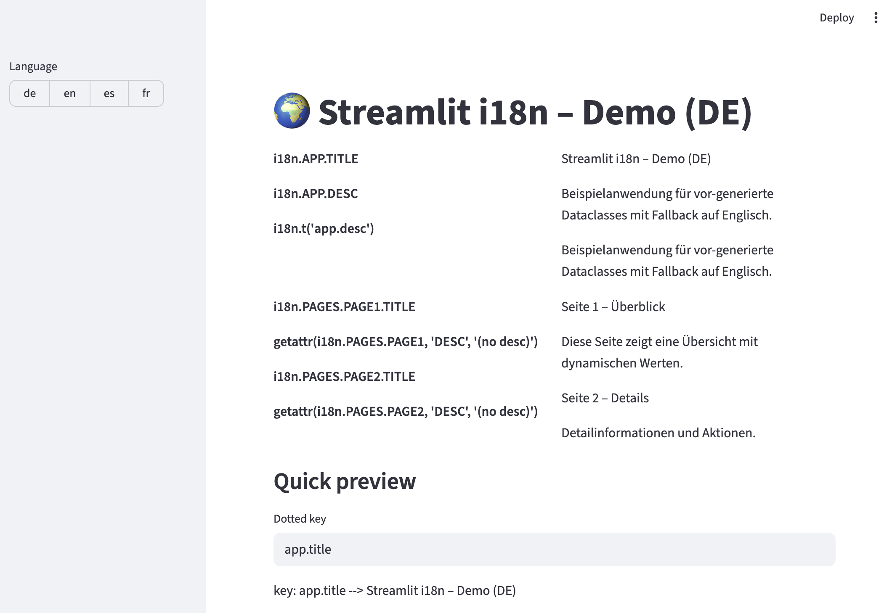

# Streamlit i18n Monorepo



Internationalization (i18n) toolkit for Streamlit apps.  
This repository contains two related packages:

---

## 1. `streamlit-i18n`

Runtime helpers for working with translations.  

### Features

- Use YAML locale files to generated dataclasses
- Pre-generated Python modules with embedded translations
- Nested dataclass support (e.g. `i18n.PAGES.PAGE1.TITLE`)
- Fallback to a base language (e.g. English)

### Install

**Path:** `streamlit-i18n`  

```bash
pip install -e streamlit-i18n
```

## 2. streamlit-i18n-cli

CLI for development and scaffolding.

### Features

- Generate Python dataclasses from YAML files

- Scaffold a demo Streamlit multi-page app

- Create sample locales (en.yml, de.yml, …)

- Convenience commands for projects using Streamlit

### Install

**Path:** `streamlit-i18n-cli`  

```bash
pip install -e streamlit-i18n-cli
```

Provides: streamlit-i18n command

### Usage

Install both packages

```bash
pip install -e ./streamlit-i18n
pip install -e ./streamlit-i18n-cli
```

Scaffold a demo application

```bash
streamlit-i18n scaffold --into demo
```


Generate dataclasses

```bash
# Switch to demo app
cd demo

# Generate dataclasses from YAML
streamlit-i18n generate \
  -i lib/i18n/locales/en.yml \
  -o i18n/dataclasses_.py \
  --rename menu=PAGES
```

Run the demo app

```bash

cd demo
just generate
just run # streamlit run Home.py
```

## Development

### Project Layout

.
├── streamlit-i18n/        # Runtime helpers
├── streamlit-i18n-cli/    # CLI tool
├── demo/                  # Scaffolded demo project
└── tests/                 # Pytest-based test suite

#### Justfile

Convenience commands are included. Typical usage:

```bash
just lint      # run pre-commit linters (ruff, isort, black, mypy, etc.)
just test      # run pytest
just build     # build distributions
just release   # publish to PyPI
```

## Demo App

The scaffolded demo (demo/) illustrates:

- Multiple locales (en, de, es, fr)

- Pages showing headers, forms, navigation, messages

- Placeholders with formatting ({date}, {users}, {amount})

- Dotted API and dataclass access side by side

Run it with:

```bash
cd demo
streamlit run Home.py
```

## Testing

Run the test suite:

```bash
pytest -q
```

## Roadmap

## License
